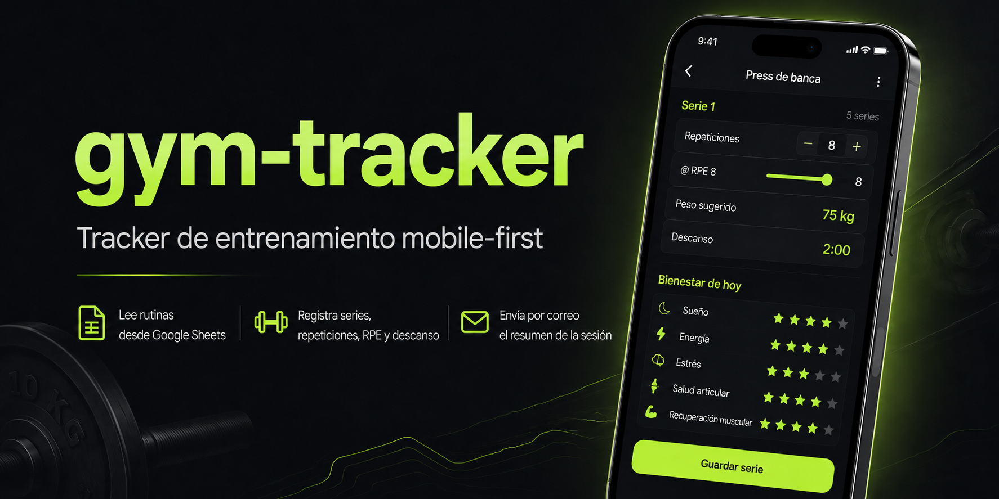

# Gym Tracker

<p align="center">
        
</p>

Web app personal mobile-first para registrar sesiones de gimnasio. Lee la planilla de entrenamiento del día desde Google Sheets, guía la sesión con cronómetros integrados y envía un resumen por email al terminar. Usuario único, login con contraseña, hosting en Cloudflare Pages a costo cero.

## Stack

- **Frontend:** HTML + CSS + Preact con HTM (sin JSX build step), Vite como bundler.
- **Backend:** Cloudflare Pages Functions (runtime Workers V8) con Hono.
- **Datos:** lectura de Google Sheets vía API key. Sin base de datos.
- **Email:** Google Apps Script Web App como webhook (Gmail personal del usuario).
- **Hosting:** Cloudflare Pages, subdominio `*.pages.dev`.

## Quickstart

```bash
git clone <repo>
cd gym-tracker
npm install
cp .env.example .env.local   # llenar con secretos de dev
npm run dev                  # http://localhost:8788
```

Para deploy, hacer push a `main` (Cloudflare construye automáticamente) o `wrangler pages deploy ./dist`.

## Estructura

```
docs/        Documentación viva (ver más abajo)
src/         Frontend (componentes Preact, estilos, libs)
functions/   Backend (rutas /api/*, parser, auth)
apps-script/ Código del Apps Script para pegar en script.google.com
public/      Assets estáticos (manifest PWA, íconos)
```

## Documentación

- [`docs/SPEC.md`](docs/SPEC.md) — especificación funcional y técnica completa: qué hace el sistema, por qué, paleta de diseño, modelo de datos, contratos de API, criterios de aceptación.
- [`AGENTS.md`](AGENTS.md) — instrucciones operativas para agentes IA (Claude Code, Codex, etc.) y desarrolladores que trabajen en el código: comandos, convenciones, reglas críticas, gotchas conocidos.

## Licencia

Proyecto personal sin licencia pública. No redistribuir.
